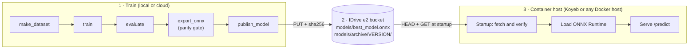

# Defect detection on steel surfaces

Classifies a photo of a steel surface into one of six defect types (NEU-DET) and returns the class with a
confidence score. A model is trained once, shipped as **one ONNX file** through an S3-compatible bucket
(IDrive e2), and served by a small FastAPI container that downloads it when it starts.



- The Docker image contains **code only**. A new model never needs an image rebuild: publish it, then restart the service.
- The `.onnx` file describes itself (class names, input size, version, git commit), so the bucket holds a single object per model and the API cannot pair a model with the wrong class list.
- If the container cannot get a valid model it **exits instead of serving**, so a host with rolling deploys keeps the previous release running.

## Quick start

```bash
python -m venv .venv && source .venv/bin/activate          # or: uv venv
# Optional, saves several GB without a GPU: CPU-only torch first
pip install torch torchvision --index-url https://download.pytorch.org/whl/cpu
pip install -r requirements.txt -r requirements-dev.txt
```

Each stage is one command (`make pipeline` runs them in order; use `make train PYTHON="uv run python"` for uv):

| Stage | Command | Writes |
|---|---|---|
| Prepare data | `python -m src.data.make_dataset` | `data/splits/{train,val,test}.csv`, `results/normalization_stats.json` |
| Train | `python -m src.models.train` | `models/best_model.pt`, `results/training_history.csv`, `results/learning_curves.png` |
| Evaluate | `python -m src.models.evaluate` | `results/test_*` (metrics, confusion matrix, errors) |
| Export | `python -m src.models.export_onnx` | `models/best_model.onnx`, `results/export_report.json` |
| Publish | `python -m src.deploy.publish_model` | `models/best_model.onnx` and `models/archive/<version>/` in the bucket |

Try the API on your machine without any bucket:

```bash
MODEL_PATH=models/best_model.onnx python -m src.serving.app      # http://127.0.0.1:8000/docs
curl -F "file=@data/raw/NEU-DET/validation/images/scratches/scratches_241.jpg" http://127.0.0.1:8000/predict
```

```json
{
  "predicted_class": "scratches",
  "confidence": 0.9731,
  "is_defective": true,
  "needs_review": false,
  "probabilities": { "crazing": 0.0042, "inclusion": 0.0051, "...": "..." },
  "model_version": "20261007T201500Z-3fa9c21",
  "inference_ms": 14.2
}
```

(The values above only show the shape of a response; your model produces its own.)

## Demo

Watch a walkthrough of the defect detection system: [Loom video](https://www.loom.com/share/e9b6d834ed7c4ddbb1145d0fec633679)

## The delivery workflow

1. **Publish** (on the training machine, with a key that can *write*):
   `python -m src.deploy.publish_model`. It first loads the file exactly as the service would, so a file the
   service would reject is never uploaded. Then it uploads an immutable copy to `models/archive/<version>/` and
   the same file to `models/best_model.onnx`, each with its sha256 stored on the object. `--dry-run` checks the
   file without touching the network, `--list` shows versions, `--promote <version>` rolls back.
2. **Start** (the container, with a key that can only *read*): fetch `models/best_model.onnx` with `boto3`
   (`HEAD`, then `GET`), compare the sha256, load it into ONNX Runtime, run one warm-up inference, and only then
   open the port. A cached copy is reused when its ETag and checksum still match the object in the bucket.
3. **Update**: after publishing, redeploy or restart the service. That is the whole release.
4. **Check your bucket settings before deploying**: `python -m src.serving.storage` fetches the model with the same
   `E2_*` variables the container reads and prints what the API would serve.

Configuration is environment variables only; copy [`.env.example`](.env.example). The required ones are
`E2_ENDPOINT_URL`, `E2_BUCKET`, `E2_ACCESS_KEY_ID` and `E2_SECRET_ACCESS_KEY`. Everything else has a default.

```bash
docker build -t defect-api .
docker run --rm -p 8000:8000 --env-file .env defect-api
```

Step-by-step setup of the bucket, keys, hosts, rollbacks and troubleshooting: [`docs/DEPLOYMENT.md`](docs/DEPLOYMENT.md).

## API

| Endpoint | Purpose |
|---|---|
| `POST /predict` | multipart field `file` (JPEG, PNG, BMP or WebP, up to 10 MB) → class, confidence, all probabilities |
| `GET /health` | 200 with the model version once the model is loaded; use it as the host's health check |
| `GET /model` | which model is serving and which bucket object it came from (with its sha256) |
| `GET /docs` | interactive OpenAPI page |

Validation and errors: the upload is decoded (the declared content type is ignored), limited in bytes and pixels,
and every failure has the same JSON shape `{ "error": { "code", "message", "request_id" } }` with a stable `code`
(`invalid_image`, `empty_file`, `file_too_large`, `unauthorized`, `validation_error`, `internal_error`). The
`request_id` is also the `X-Request-ID` header and appears in the logs. Set `API_KEY` to require an `X-API-Key`
header on `/predict`. Inference runs in a worker thread with a concurrency cap, so `/health` stays responsive under load.

## Dataset strategy

- **Data**: NEU-DET, 1,800 images of hot-rolled steel, 300 per class, 200×200 grayscale stored as RGB JPEG. Six
  defect types: crazing, inclusion, patches, pitted surface, rolled-in scale, scratches. See `results/data_summary.txt`
  and `results/sample_grid.png`.
- **There are no "normal" images in NEU-DET.** This is a six-way defect-type classifier, not a normal-versus-defective
  detector (see limitations).
- **Splits** (`src/data/make_dataset.py`, stratified and seeded): the official *validation* folder is kept whole as the
  **test set** (360) so results stay comparable with published work and no test image influences training. A stratified
  15% of the official train folder becomes the **validation set** (216) used to pick the best epoch. The remaining
  **1,223** images train the model.
- **Leak check**: the script hashes every file. It found that `patches_101.jpg` and `patches_105.jpg` are byte-identical;
  duplicates are dropped before splitting, and a cross-split check confirms zero shared images between train, val and test.
- **Imbalance**: the classes are balanced (ratio 1.00), so no resampling. The loss still uses inverse-frequency class weights
  computed from the training split (all ≈ 1.0 today), so retraining on an unbalanced dataset needs no code change.
- **Normalisation** statistics are computed on the training split only (`results/normalization_stats.json`).

## Model approach

- **Transfer learning**: an ImageNet-pretrained CNN fine-tuned end to end. 1.2k images are too few to learn good filters
  from scratch, and ImageNet features (edges, textures) transfer well to metal surfaces.
- **Architecture: ResNet-18 by default**, the conventional baseline: it fine-tunes predictably and exports to ONNX with plain
  operators. The three supported backbones, measured with this repository's own export and timing code (random weights, since
  latency does not depend on them; batch of one; one thread of a 2.8 GHz Xeon):

  | `--arch` | parameters | ONNX file | latency p50 / p95 |
  |---|---|---|---|
  | `resnet18` (default) | 11.2 M | 42.6 MB | 35.4 / 42.4 ms |
  | `mobilenet_v3_large` | 4.2 M | 16.0 MB | 8.9 / 10.6 ms |
  | `efficientnet_b0` | 4.0 M | 15.2 MB | 17.4 / 23.1 ms |

  The classes are visually distinct textures and the dataset is small, so model capacity is unlikely to be the bottleneck; what
  matters on a small host is latency, memory and the model download on every cold start. Accuracy could not be compared here
  (it needs the pretrained run), so decide with data: train both, compare test macro-F1, and ship the lighter model if it is within
  about a point of ResNet-18.
  ```bash
  python -m src.models.train                                                    # resnet18 -> models/best_model.pt
  python -m src.models.train --arch mobilenet_v3_large --output models/mobilenet.pt
  python -m src.models.evaluate --checkpoint models/mobilenet.pt --results-dir results/mobilenet
  ```

- **Augmentation**: random resized crop (scale 0.8–1.0), horizontal and vertical flips, random 90° rotations, brightness and
  contrast jitter. Flips and 90° turns are lossless and label-preserving because a steel surface has no "up". Hue and saturation
  jitter are left out because the images are gray.
- **Training**: AdamW (lr 3e-4, weight decay 1e-4), cosine schedule, up to 15 epochs, label smoothing 0.05 (it keeps the softmax
  confidence from saturating at 1.0). The **best epoch is chosen by validation macro-F1**, not accuracy, with early stopping
  after 5 epochs without improvement.
- **Normalisation is inside the model.** The network takes RGB pixels in [0, 1]; mean/std are part of the graph. Training,
  evaluation, the exported file and the API therefore all feed it the same thing.
- **Export gate**: before `best_model.onnx` appears, `export_onnx` runs it through ONNX Runtime on real images, fed by the *API's*
  preprocessing code, and requires the logits to match PyTorch (tolerance 1e-3; it measured about 1e-6) and the preprocessing
  to be bit-identical to training's. If anything differs nothing is written.
- Training time depends on hardware: roughly 1.5–3 minutes per epoch on a 4-core CPU, seconds on a GPU.

## Evaluation and error analysis

`python -m src.models.evaluate` scores the **test split** once and writes, to `results/`:

| File | Content |
|---|---|
| `test_metrics.json` | accuracy; macro and per-class precision, recall, F1; confusion matrix; false positives and false negatives per class; top confusions; calibration error; confidence-versus-coverage trade-off |
| `test_classification_report.txt` | the same table in text form |
| `test_confusion_matrix.png` | counts per (true, predicted) pair |
| `test_errors.csv` | every mistake with its confidence, the probability given to the true class and the runner-up |
| `test_error_examples.png` | the most *confident* mistakes, the most worrying ones |

Because there is no normal class, a *false positive for class X* means "predicted defect X when it was another defect" and a
*false negative for X* means "missed an X". Precision therefore tracks false positives and recall tracks false negatives, per
defect type. The confidence-versus-coverage table shows what happens if you only act automatically above a threshold and send the
rest to a person, which is the intended use of `needs_review`.

**Results:** run `make train evaluate` and paste your numbers here. They are not committed, because the final model is trained on
your own machine or cloud GPU and I could not download ImageNet weights in the environment this repository was prepared in.

## Known limitations

- **No normal class.** The model cannot say "this surface is fine": it always picks one of six defects, so `is_defective` is
  always `true` for it. `needs_review` (confidence under 0.6) is a heuristic, and softmax confidence can stay high on images unlike
  the training data. To get a real normal-versus-defective decision, collect normal images, add a `normal` class, retrain and export with
  `--normal-class normal`; the API needs no change.
- **Narrow data.** One camera setup and 1.8k images: expect lower accuracy under different lighting, resolution or steel types.
  Re-evaluate on a sample from the real line before relying on the numbers.
- **Model updates need a restart.** Containers read the bucket only at startup (by design: simple and predictable). There is no hot reload.
- **Cold starts download the model** (about 43 MB). Hosts that scale to zero or sleep when idle add that to the first request after a pause.
- **One process, CPU only.** Latency depends on the host: the table above is one thread of a 2.8 GHz Xeon, and a host with a fraction
  of a CPU will be proportionally slower. Throughput is capped by `MAX_CONCURRENT_INFERENCES`.
- **Auth is a single optional shared key**, and there is no rate limiting. Put the service behind a gateway if it is exposed publicly.
- **Verified against a local S3 server (moto), not against a real IDrive e2 account**, and the Dockerfile could not be built where this
  was developed (no Docker daemon). CI builds the image and smoke-tests it; run `make check-bucket` once with your real keys.

## Repository layout

```
src/data/        inspect_data, make_dataset (splits, de-duplication, normalisation statistics)
src/models/      build (model + baked-in normalisation), dataset (transforms), train, evaluate, export_onnx
src/deploy/      publish_model (upload, promote, list)
src/serving/     contract (ONNX metadata schema), settings, storage (S3 fetch), inference, app (FastAPI)
src/utils/       config (paths, constants), provenance (git commit, timestamps)
tests/           inference, storage against a local S3 server, API, publish, training and export
docs/            DEPLOYMENT.md
Dockerfile  .env.example  Makefile  requirements*.txt  .github/workflows/ci.yml
```

## Tests and CI

```bash
pip install -r requirements.txt -r requirements-dev.txt
python -m pytest -q          # about a minute; the torch tests skip themselves if torch is missing
ruff check src tests
```

The suite builds a tiny ONNX model with the `onnx` helpers (no torch) and runs a local S3 server, so everything is offline. It covers
the model contract, settings validation, image decoding limits, checksum and cache behaviour, retry classification, startup failure
modes, request ids, authentication, publish and rollback, and the full train → export → serve hand-off. GitHub Actions runs the serving
tests with the same pinned dependencies as the image, the training tests with CPU torch, and builds and smoke-tests the Docker image.
